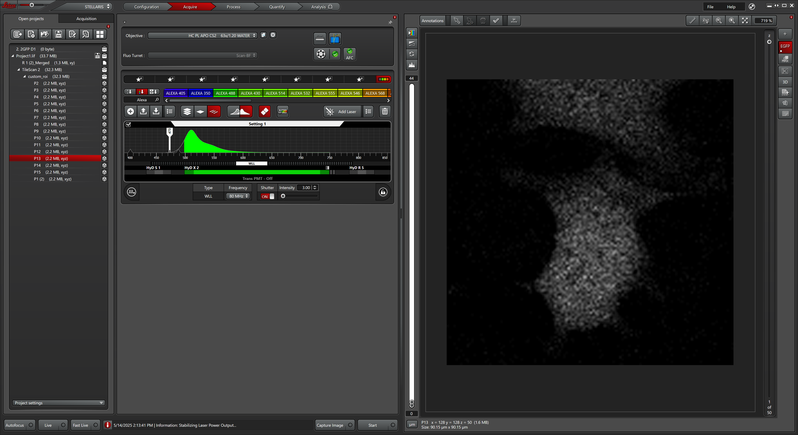

# Leica_ROI_finder
Automatic ROI finder for Leica Stellaris 8
- Automatic segmentation using cellpose 3
- ROI filtering using intensity, size and circularity
- Exports ROIs to Leica .rgn files, can be imported into LAS X navigator

# Workflow
Load LIF image into ROI finder:

Perform segmentation using cellpose, filter ROIs using intensity, size and circularity:

Export ROIs to Leica .rgn format and import into LAS X Navigator:

Perform imaging on all regions:

